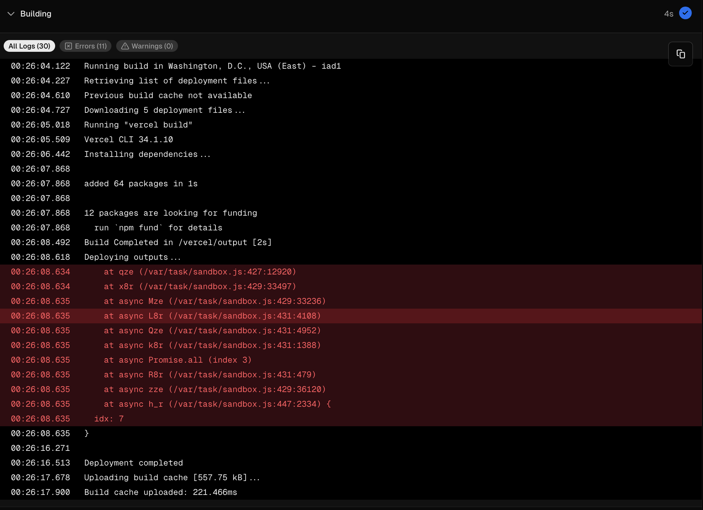

# vercel-build-issue
A subset of causes demonstrates a strange issue in the build. The issue occurs when the project is deployed to Vercel (with Vercel CLI 34.1.7). The issue is not reproducible in the local environment.
(More details in the [issue](https://github.com/orgs/vercel/discussions/6714)

# Install
```bash
npm install
```

# Development
```bash
npm run dev
```

# Deploy 
```bash
npm run deploy
```

# How to reproduce the issue
1. Clone the repository
2. Run `npm install`
3. Run `npm run deploy`
4. Open the deployed [URL](https://vercel-build-issue.vercel.app/api) 
5. Check build logs, you will see the following error:
[](./build-error.png)


